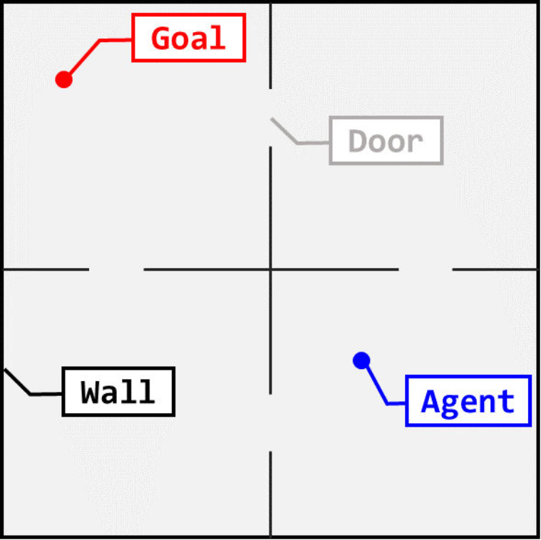

# continuous_four_room

The continuous version of four-room environment. 



The agent tries to enter into the vicinity of the goal.

## Getting Started

These instructions will get you a copy of the project up and running on your local machine for development and testing purposes.

### Prerequisites

python=3.6

numpy=1.16.3

gym

### Installing

You can perform an installation ``continuous_four_room`` by following:

```
git clone git@github.com:woluo/continuous_four_room.git
```


## Authors

* **Jiajun Fei**

* **Zhimin Hou**
